# Kickpact — bet on football with a wallet that's yours

> A self‑custodial, mobile‑first **World Cup prediction app**. Your wallet holds **USD₮** and never leaves your phone — then you bet three ways: trustless **Pacts** with a friend, a Tinder‑style on‑chain **Duel**, or real‑money **Polymarket** markets. Fans of the same match meet in a **peer‑to‑peer watch party** over Hyperswarm — no server, messages signed by your wallet.

<p>
  
  
  
  
  
</p>

---

## ▶️ 60‑second launch video

<!-- VIDEO_EMBED -->
<p align="center">
  <a href="https://github.com/nickthelegend/kickpact/releases/download/v1.0.0/kickpact-launch.mp4">
    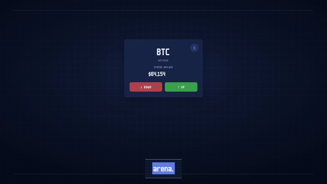
  </a>
</p>

<p align="center">
  <sub>▶️ <b><a href="https://github.com/nickthelegend/kickpact/releases/download/v1.0.0/kickpact-launch.mp4">Watch the full 60‑second launch video, with sound</a></b> — the loop above is a silent preview.<br/>
  🎬 <b><a href="https://github.com/nickthelegend/kickpact/releases/download/v1.0.0/kickpact-demo.mp4">Full product demo (2:17)</a></b> — launch film + live walkthrough + the 3‑platform P2P room recorded live.</sub>
</p>

---

## The app, screen by screen

<table>
  <tr>
    <td width="33%">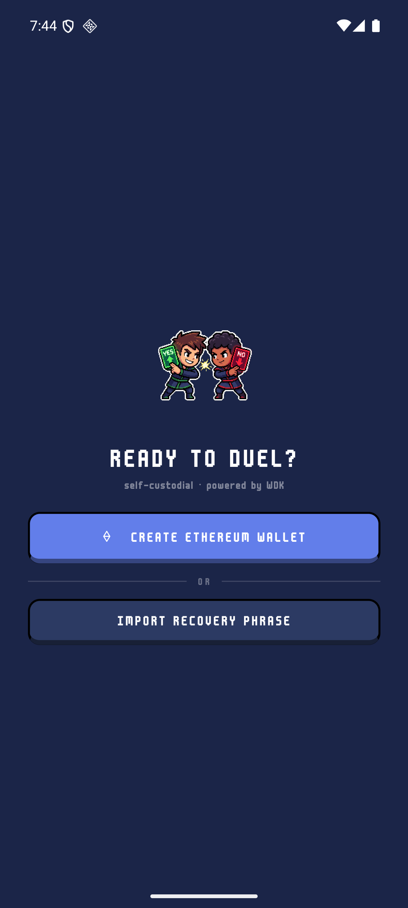<br/><sub><b>Self‑custodial onboarding</b> — a real 12‑word wallet, powered by WDK. No email, no custodian.</sub></td>
    <td width="33%">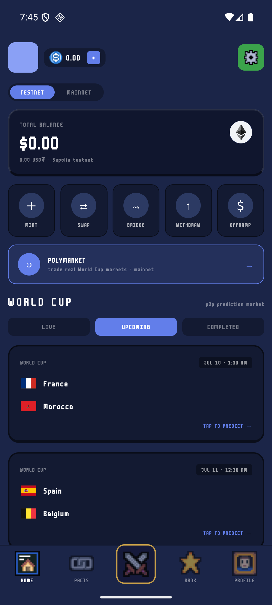<br/><sub><b>Home</b> — USD₮ balance on Sepolia, WDK actions (mint · swap · bridge · withdraw · off‑ramp), live World Cup fixtures.</sub></td>
    <td width="33%">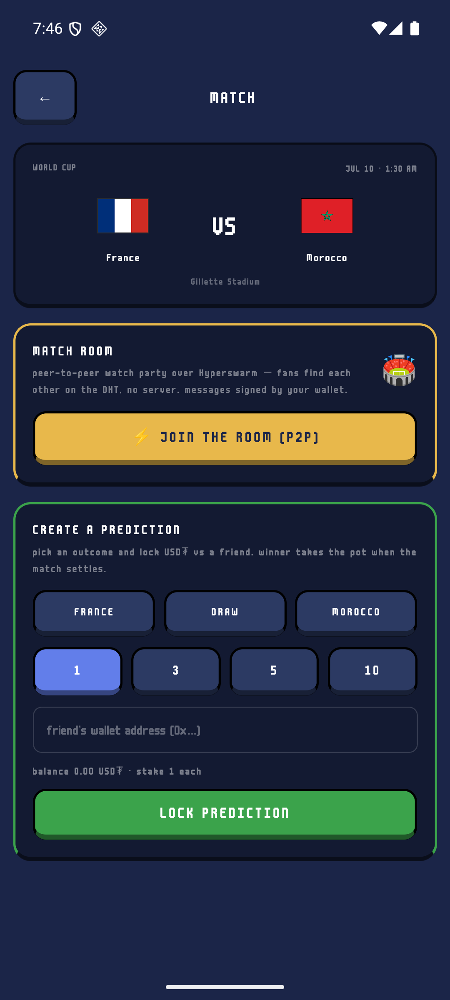<br/><sub><b>Match</b> — join the P2P watch party, or lock a USD₮ prediction against a friend.</sub></td>
  </tr>
  <tr>
    <td width="33%">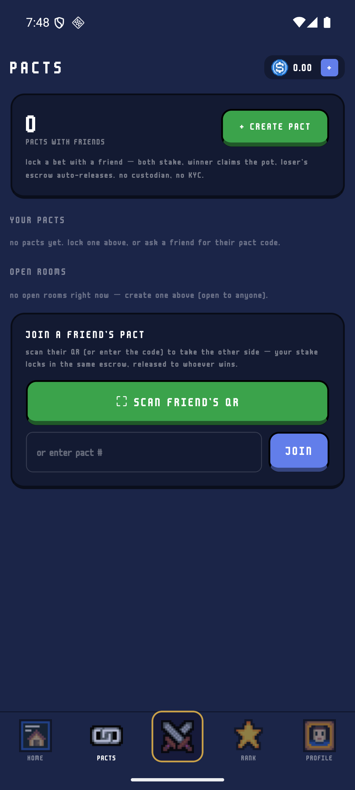<br/><sub><b>Pacts</b> — escrow a bet with a friend or an open room. Winner claims the pot; loser's escrow auto‑releases. No custodian, no KYC.</sub></td>
    <td width="33%">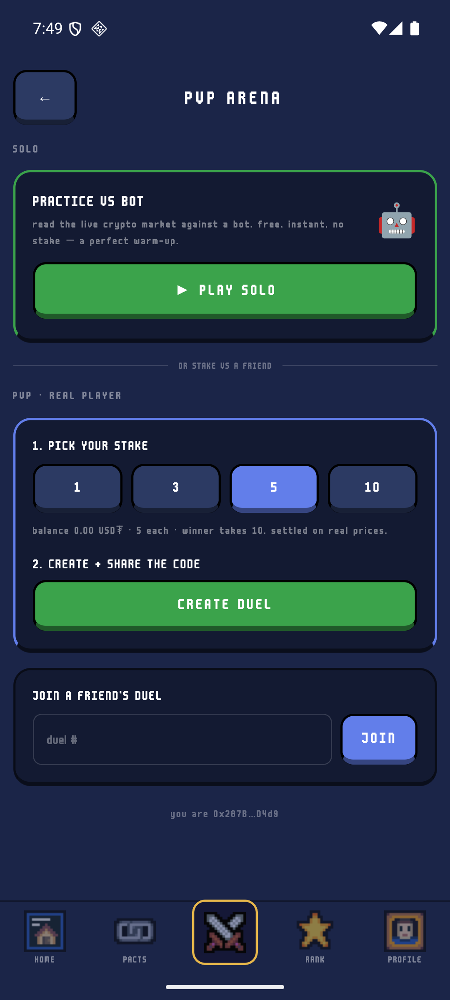<br/><sub><b>PvP Arena</b> — practice vs a bot for free, or stake a real 1v1 Duel and share the code.</sub></td>
    <td width="33%">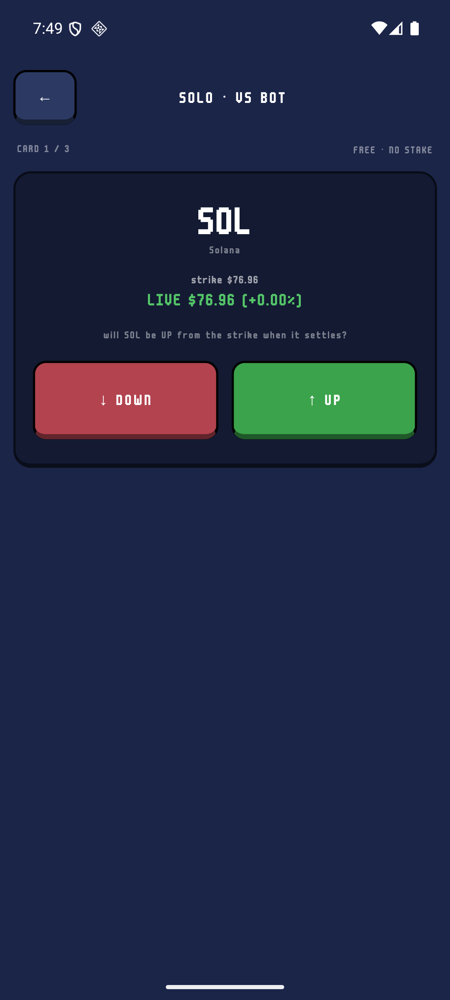<br/><sub><b>Duel</b> — swipe UP/DOWN through a deck of live‑price cards. Best market‑reader takes the pot.</sub></td>
  </tr>
  <tr>
    <td width="33%">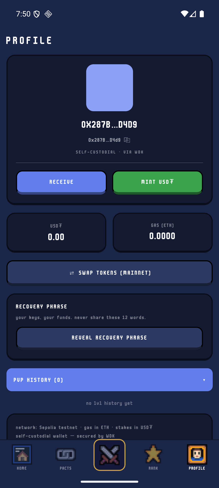<br/><sub><b>Profile</b> — your address + receive QR, USD₮/ETH balances, and reveal‑recovery‑phrase. Keys never leave the device.</sub></td>
    <td width="33%">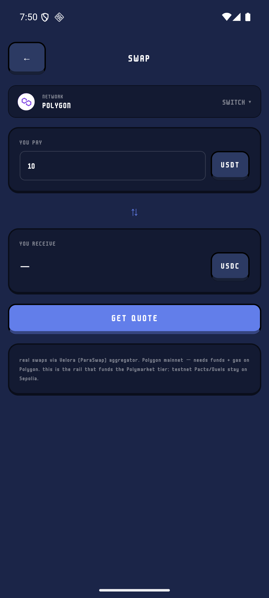<br/><sub><b>Swap</b> — real on‑chain USD₮→USDC via the Velora/ParaSwap aggregator on Polygon: the rail that funds the Polymarket tier.</sub></td>
    <td width="33%">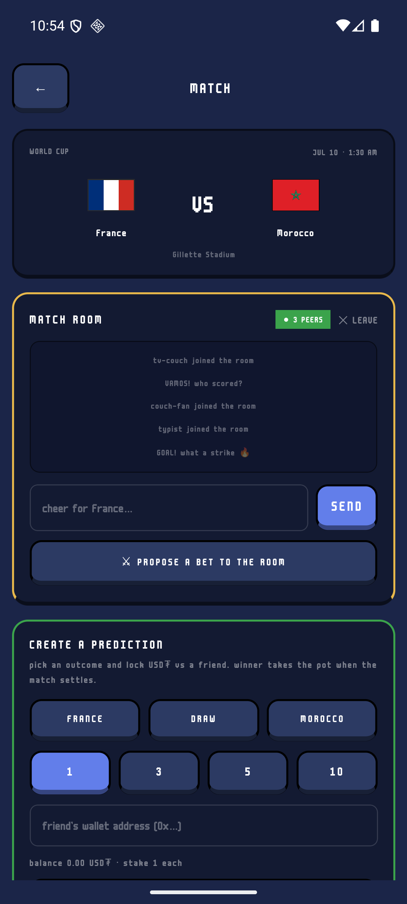<br/><sub><b>Match Room, live P2P</b> — the release app in a Hyperswarm room with three desktop Bare peers (<code>● 3 PEERS</code>), their messages arriving serverlessly over the public DHT.</sub></td>
  </tr>
  <tr>
    <td width="33%">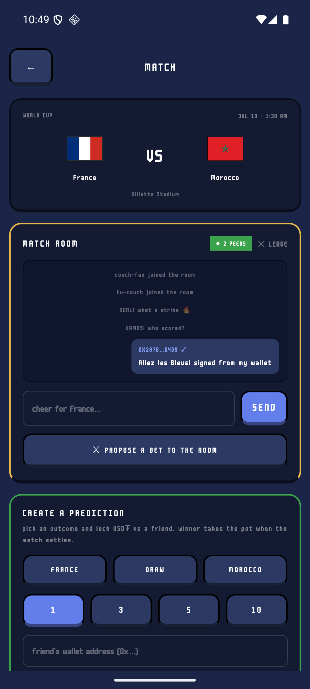<br/><sub><b>Wallet‑signed chat</b> — the phone's message goes out signed by the WDK key; desktop peers verify it (<code>[0x287B…D4d9 ✓signed]</code>).</sub></td>
    <td width="33%"><br/><sub><b>Desktop app (Mac/Win/Linux)</b> — Electron + <code>pear-runtime</code> Bare worker, same pixel UI, same swarm: the phone's <code>✓ SIGNED</code> message rendering live next to desktop peers.</sub></td>
    <td width="33%">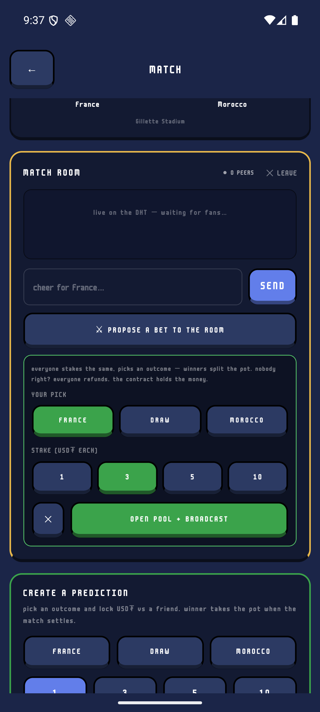<br/><sub><b>Group pool</b> — the watch‑party pot, started from the P2P room: everyone stakes the same, picks an outcome, winners split the pot. The contract holds the money. Live on Sepolia.</sub></td>
  </tr>
</table>

---

## Why Kickpact

Football is the world's biggest social ritual — and the way people already "bet" on it (group chats, side‑bets with friends, the office pool) is trustless in spirit but custodial and messy in practice: someone holds the money, someone has to be trusted to pay out.

Kickpact keeps the ritual and removes the trust problem. Every stake sits in **on‑chain escrow that only the outcome can release**, the money lives in a **wallet you alone control**, and the whole thing feels like a pixel‑art mobile game rather than a DeFi terminal.

> **Your keys. Your USD₮. Your call on the match.**

---

## Three ways to bet — one wallet, one USD₮ balance

| | Tier | What it is | Where |
| --- | --- | --- | --- |
| 🤝 | **Pacts** | Escrow a bet with a friend (or an open room anyone can join). Both sides stake equal USD₮; the winner claims the pot, the loser's escrow auto‑releases. Resolve by mutual agreement or a neutral arbiter. | `KickpactPacts` on **Sepolia** |
| ⚔️ | **Duels** | A Tinder‑style 1v1: both players swipe UP/DOWN through a commit‑revealed deck of "will this asset beat its strike?" cards. The contract escrows both stakes and pays the better reader — a correct contrarian call scores more than following the crowd. Free practice‑vs‑bot mode too. | `KickpactDuel` on **Sepolia** |
| 📈 | **Polymarket** | Trade **real‑money** World Cup markets **in‑app**: the WDK wallet EIP‑712‑signs Fill‑or‑Kill orders and posts them straight to Polymarket's CLOB (live order‑book prices, USDC.e allowance flow — byte‑identical to the official SDK, proven by test). | Polymarket CLOB on **Polygon** |

The in‑app **Swap** and **Bridge** screens exist to move USD₮ onto Polygon and fund that third tier; the testnet Pacts and Duels stay on Sepolia.

---

## WDK track — a wallet that never leaves the phone

Kickpact is built around the **Wallet Development Kit**: the wallet *is* the identity, and the same key that holds your USD₮ also signs your bets and your chat.

- **Secure storage (real WDK).** The seed is sealed with [`@tetherto/wdk-react-native-secure-storage`](https://www.npmjs.com/package/@tetherto/wdk-react-native-secure-storage) into the device keychain (Secure Enclave / StrongBox) behind biometrics — `apps/mobile/src/storage.native.ts`.
- **Self‑custodial wallet.** On‑device BIP‑39 seed, 12‑word backup / import, an explicit `INITIALIZING → NO_WALLET → BACKUP_PENDING → READY` state machine that mirrors WDK RN core — `apps/mobile/src/wallet.tsx`.
- **Swap** — real swaps via the Velora/ParaSwap aggregator (`src/swap.ts`), shaped to drop in `@tetherto/wdk-protocol-swap-velora-evm`.
- **Bridge** — cross‑chain USD₮ via the **USD₮0 / LayerZero OFT** (`src/bridge.ts`), mirroring `@tetherto/wdk-protocol-bridge-usdt0-evm` with the verified OFT addresses + LayerZero EIDs.
- **Fiat on/off‑ramp** — MoonPay buy/sell widget (`src/fiat.ts`), mirroring `@tetherto/wdk-protocol-fiat-moonpay`.

> **Honest scope:** secure‑storage is a live WDK integration. Swap / bridge / fiat / core are implemented in ethers against the exact WDK module surface so the real `@tetherto/wdk-protocol-*` packages drop straight in — and the bridge registry (OFT contracts + LayerZero EIDs) is **pinned by a CI parity test to the real `@tetherto/wdk-protocol-bridge-usdt0-evm` config**, so it can never drift from Tether's shipped values.

---

## Pears track — the peer‑to‑peer watch party

Open any match and you can **join the room**: a serverless watch party where fans of the same game find each other on the Hyperswarm DHT.

- **Real P2P.** A **Bare** worklet (`react-native-bare-kit`) runs **Hyperswarm** on the phone and joins a topic derived from the match id — `hash("kickpact/match/<gameId>")` — so everyone watching the same game lands in the same swarm. `apps/mobile/src/room.ts`.
- **Signed identity = wallet identity.** Every message is signed with your WDK key and verified with `ethers.verifyMessage`; verified peers render ✓, unsigned ones ⚠.
- **Bet from the room.** Propose a wager in‑chat and it opens an on‑chain `KickpactPacts` escrow (open room, keeper arbiter); other fans tap *join bet* to take the other side. QR "join‑escrow" flows through the same contract.
- **Group pools — the watch‑party pot.** Start a pool in the room: everyone stakes the same USD₮ into the `KickpactPools` contract and picks an outcome (home/draw/away). After the match the keeper posts the official result and **everyone who called it splits the pot equally** (nobody right → everyone refunds; keeper absent → self‑refund after a grace period). The pool broadcast rides the same P2P wire, and the contract — not a friend — holds the money. 15 Foundry tests + an anvil E2E through the app's own ABI. **Proven live on Sepolia:** a real 3‑friend pool ([create](https://sepolia.etherscan.io/tx/0xcc9a5365eca75cba8c57669254389791d94212e22de51ea766b206f39c1de995) → 2 joins → [keeper settle](https://sepolia.etherscan.io/tx/0xf6906a120123b918a6dce1f070b56ebd8da2268f1d70feb53cd14bf51006ec5e) → winners each [claimed 7.5 USD₮](https://sepolia.etherscan.io/tx/0x85f51f6d477bffea7be1efcd5f58d90ebb961d83f2e923f0748c7ead61bfba09), pot drained to zero).
- **Desktop app (Mac / Windows / Linux).** [`apps/desktop`](apps/desktop) is the Watch Party as a real desktop app — the same pixel UI, built on the Pears stack: an Electron shell whose P2P layer runs in a **Bare worker** spawned by `pear-runtime` (the [hello-pear-electron](https://github.com/holepunchto/hello-pear-electron) architecture). `apps/pear/` additionally ships an **interactive terminal peer on Bare**: `bare cli.js <gameId> <nick>` — type to chat, same rooms.
- **Verified live, end‑to‑end.** The Android release build, the Electron desktop app, and Bare CLI peers all met in room `760510` over the **public DHT**: messages flowed every direction, and the phone's reply rendered everywhere as `0x287B…D4d9 ✓ signed` — wallet‑verified, no server anywhere. Screenshots above.

---

## What's on‑chain

Solidity 0.8.28, Foundry, deployed to **Ethereum Sepolia** (`chainId 11155111`). Source in [`apps/duel-evm/src`](apps/duel-evm/src), addresses in [`apps/duel-evm/deployed.json`](apps/duel-evm/deployed.json).

| Contract | Address (Sepolia) |
| --- | --- |
| **KickpactDuel** | [`0x045Ad96EB24CE29f02C4E41542507DE26FE13895`](https://sepolia.etherscan.io/address/0x045Ad96EB24CE29f02C4E41542507DE26FE13895) |
| **KickpactPacts** (v2, open rooms) | [`0xc84a624109e6406d1a5Aa8413B19a1CFFCFe7f5A`](https://sepolia.etherscan.io/address/0xc84a624109e6406d1a5Aa8413B19a1CFFCFe7f5A) |
| **MockUSDT** (USD₮, 6dp, open faucet) | [`0x4802B35fFE360CAcF7bc22702544DDA207b950A3`](https://sepolia.etherscan.io/address/0x4802B35fFE360CAcF7bc22702544DDA207b950A3) |
| **KickpactPools** (group watch‑party pots) | [`0xEd37D097BBA4C7FA514733C62F62787b9Ba6f445`](https://sepolia.etherscan.io/address/0xEd37D097BBA4C7FA514733C62F62787b9Ba6f445) |
| **oracleKeeper** (settles duels + match results) | [`0x72AE77B55A9195526170bb4D8D2B6f20d37b8262`](https://sepolia.etherscan.io/address/0x72AE77B55A9195526170bb4D8D2B6f20d37b8262) |

Stakes and payouts are in **USD₮** (6 decimals); gas is Sepolia ETH. On Polygon, the swap/bridge/Polymarket tier uses real Tether (`0xc2132D05D31c914a87C6611C10748AEb04B58e8F`). Cross‑chain moves go over **USD₮0** (LayerZero OFT).

---

## Architecture

```
kickpact/
├── apps/
│   ├── mobile     # Expo / React Native — the app (WDK wallet, 3 bet tiers, Hyperswarm rooms)
│   ├── duel-evm   # Solidity + Foundry — KickpactDuel, KickpactPacts, MockUSDT (Sepolia)
│   ├── desktop    # Watch Party for Mac/Win/Linux — Electron + pear-runtime Bare worker
│   ├── pear       # Bare terminal peer (interactive CLI) + legacy Pear-1 GUI
│   └── server     # Bun — oracle/settlement keeper
└── videos/
    └── kickpact-launch   # the HyperFrames project for the 60s launch video
```

| Layer | Stack |
| --- | --- |
| **Mobile** | Expo ~56 · React Native 0.85 · React 19 · TypeScript · ethers v6 · **WDK secure‑storage** · biometrics (`expo-local-authentication`) · QR (`expo-camera`) · pixel UI. App id `io.kickpact.app`. |
| **Contracts** | Solidity 0.8.28 · Foundry (Forge/Cast/Anvil) · Sepolia |
| **P2P** | Hyperswarm DHT · **Bare** runtime (`react-native-bare-kit` on mobile, **Pears** on desktop) · wallet‑signed JSON wire |
| **Backend** | Bun — on‑chain oracle/settlement keeper |
| **External** | ESPN (fixtures/results) · Polymarket Gamma API (markets) · Velora/ParaSwap (swap) · LayerZero USD₮0 (bridge) · MoonPay (fiat) |

---

## Run it locally

```bash
bun install                       # install all workspaces (Bun ≥ 1.3)

# mobile app
bun --filter mobile start         # Expo dev server
#   → build a dev/release APK from apps/mobile/android, or run on a device

# desktop watch party (Mac/Win/Linux)
cd apps/desktop && bun install && bun run start

# contracts
cd apps/duel-evm && forge test    # Solidity test suite
```

The self‑custodial wallet generates a real seed on first launch. **First run:** grab a drop of free Sepolia ETH for gas ([Google faucet](https://cloud.google.com/application/web3/faucet/ethereum/sepolia)) — the app links you there if you forget — then mint USD₮ from the in‑app faucet and you're ready to bet.

## Tests

Three layers, all runnable offline:

| Suite | What it covers | Run |
| --- | --- | --- |
| **Contracts** | 27 Foundry tests — duel lifecycle, pact escrow, refunds, timeouts | `cd apps/duel-evm && forge test` |
| **Android app — unit** | Room wire protocol (framing, signed payloads, ethers verify), deterministic pact terms + keccak parity with the contract, ESPN fixture parser, CLOB client primitives (HMAC auth vectors, EIP‑712 order round‑trip, SDK rounding math) | `cd apps/mobile && bun test src` |
| **Android app — integration** | The app's exact P2P wire end‑to‑end over a **hermetic in‑process DHT**; **CLOB wire parity** — our hand‑rolled client produces byte‑identical signed orders to the official `@polymarket/clob-client` (signature included, both exchanges); live CLOB API (Gamma markets, order‑book price, L1 EIP‑712 auth deriving real API creds); WDK bridge‑registry parity | `cd apps/mobile && npm run test:integration` |
| **Desktop app — unit** | Room core: topic derivation (cross‑platform constant), chunk‑safe framing, message shapes, signed/unsigned badges | `cd apps/desktop && npm test` |
| **Desktop app — integration** | Real Hyperswarm rooms on the hermetic DHT: peers meet + chat, room isolation, wallet‑signature verification, pact passthrough | `cd apps/desktop && npm run test:integration` |

---

## Demo notes & status

**Shipped — live on Sepolia.** Self‑custodial WDK onboarding, the three bet tiers (Pacts / Duels / Polymarket), the Hyperswarm watch‑party rooms with wallet‑signed chat and in‑room escrow bets, and the swap/bridge rails all run end‑to‑end. The screenshots above are from the release build (`io.kickpact.app`) on a fresh, unfunded testnet wallet.

<details>
<summary>Archived: the earlier project video</summary>

An earlier iteration of this repo was a Sui prediction‑duel; its 4‑minute demo lives at <https://youtu.be/sKIKsmdRs9U> and is kept for history only. It does **not** describe the current Tether Developers Cup app documented above.
</details>
