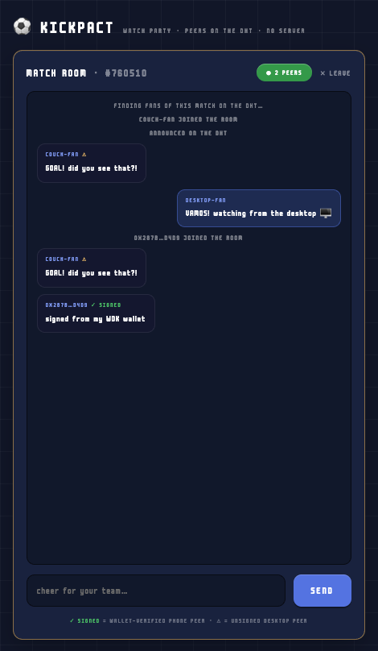

# Kickpact Watch Party — desktop app (Pears track)

The Kickpact Match Rooms on **Mac / Windows / Linux** — same pixel UI as the
mobile app, same rooms, same swarm. Built on the **Pears stack**: an Electron
shell whose P2P layer runs in a **Bare worker** spawned by
[`pear-runtime`](https://www.npmjs.com/package/pear-runtime) (the
[hello-pear-electron](https://github.com/holepunchto/hello-pear-electron)
architecture).



- **Topic**: `hash("kickpact/match/<gameId>")` — the ESPN match id from the
  Kickpact match page. Phones, desktops and CLI peers mingle in one swarm.
- **Wire**: newline-JSON `{type:"hello"|"msg"|"pact"}` over encrypted
  Hyperswarm sockets.
- **Identity**: phone messages arrive signed by their WDK wallet key and show
  **✓ signed**; desktop peers are unsigned (**⚠**).
- **Bets**: `pact` messages are on-chain USD₮ escrow proposals (KickpactPacts
  on Sepolia). The desktop shows them; taking a side happens in the mobile app.

## Architecture

```
electron/main.js      spawns Bare workers via pear-runtime, relays framed IPC
electron/preload.js   sandboxed bridge: renderer ⇄ worker streams
workers/room.js       worker entry — FramedStream(Bare.IPC) ⇄ room-core
workers/room-core.js  Hyperswarm room (topic + wire, shared with mobile/CLI)
renderer/             the UI — Kickpact design tokens from the mobile app
```

## Run it

```bash
cd apps/desktop
bun install          # downloads Electron (trustedDependencies)
bun run start        # electron-forge start
```

Enter a match id (e.g. `760510`), a nickname, and **⚡ JOIN THE ROOM (P2P)**.
Anyone on the same match — a phone running Kickpact, another desktop, or the
terminal peer (`apps/pear`) — appears in the room with no server anywhere.

## Package installers

```bash
bun run make         # .zip (all platforms) + .dmg (macOS)
```

Electron Forge builds per-OS: run `make` on Windows for the Windows build.

## Tests

```bash
npm test                  # unit — topic/framing/message shapes (node --test)
npm run test:integration  # real Hyperswarm rooms on a hermetic in-process DHT:
                          # peers meet + chat, room isolation, wallet-signed
                          # message verification (ethers), pact passthrough
```

The integration suite runs a local `hyperdht` testnet in-process — no public
network, deterministic, CI-safe.

## Verified live

This app, the Android release build, and a Bare CLI peer met in match room
`760510` over the **public DHT**: the desktop rendered the phone's message as
`0X287B…D4D9 ✓ SIGNED` (wallet-verified), and both received the desktop's
replies. Screenshot above.
